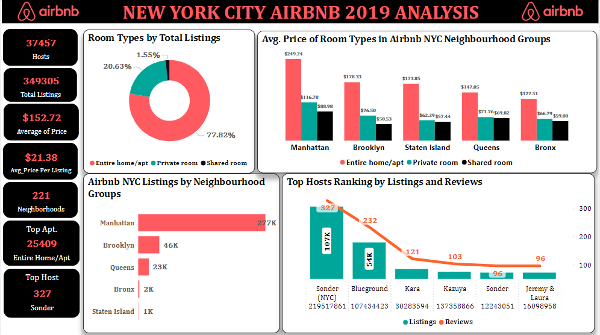

<<<<<<< HEAD
# NEW YORK CITY AIRBNB (2019) DATA ANALYSIS

## Overview
>This dataset describes all the listings and performance metrics of New York City Airbnb for the year 2019. The dataset provides all the information required to delve into the hosts details, locations, availability and important metrics for analysis.
## Aim
This project aims to extract actionable insights from the Airbnb dataset to understand the factors influencing listing performance and guest satisfaction. 
## Objective
>The objectives of this analysis are:
1.	To analyze the distribution and pricing of Airbnb listings across different neighborhoods.
2.	To identify the relationship between property characteristics (e.g., room type, availability) and pricing.
3.	To examine the impact of reviews on Airbnb listings.
4.	To examine host performance metrics and trends.

## Dataset
**Data Source:** [New York City Airbnb Open Data] (https://www.kaggle.com/datasets/dgomonov/new-york-city-airbnb-open-data)

The original dataset consists of 16 columns and 48,896 rows. Metadata below:
1.	Id: A unique identifier for each Airbnb listing in the dataset. 
2.	Name: The name of the Airbnb listing. 
3.	Host_id: A unique identifier for each host on Airbnb. 
4.	Host_name: The name of the host who manages the Airbnb listing.
5.	Neighbourhood_group: The broader geographical region or group within which the neighbourhood is located. 
6.	Neighbourhood: The specific neighbourhood or area where the Airbnb property is situated. 
7.	Latitude: The geographic latitude coordinate of the Airbnb listing's location. 
8.	Longitude: The geographic longitude coordinate of the Airbnb listing's location.
9.	Room_type: The type of room or accommodation offered by the Airbnb listing (Entire home/apt, Private room, Shared room). 
10.	Price: The nightly rental price for the Airbnb listing 
11.	Minimum_nights: The minimum number of nights required for booking the Airbnb listing.
12.	Number_of_reviews: The total number of reviews left by guests who have stayed at the Airbnb listing.
13.	Last_review: The date of the most recent guest review for the Airbnb listing.
14.	Reviews_per_month: The average number of reviews received per month for the Airbnb listing. 
15.	Calculated_host_listings_count: The count of listings managed by the host, including the current one, in the Airbnb platform.
16.	Availability_365: The number of days in a year that the Airbnb listing is available for booking.

## Methodology
1. Data Cleaning and Transformation: The dataset was duplicated and a copy was cleaned in Microsoft Excel for cleaning and transformation. Then, it was loaded into Power BI for Data Visualisation.
2. Data Visualization: Different visualizations such as bar charts, pie charts, etc were employed to visualize trends and derive actionable insights.
3. Exploratory Analysis: It was used to identify general patterns in the data.

## Data Analytics Tools
**Microsoft Excel**
**Power Bi**

## Data Visualization

## Key Insights
1.	There were 37,457 unique hosts
2.	There were 349,305 total listings.
3.	The average price for the room types is $152.72.
4.	The average price per stay for Airbnb in New York City is $21.38.
5.	The dataset contains 221 neighbourhoods.
6.	The most common room type is the “Entire Home/Apt”.
7.	Sonder (NYC) emerged as the top host.

## Conclusion
This analysis has provided key and valuable insights into the Airbnb market trends in New York City. It was discovered that:
1.	Manhattan is the top neighbourhood group in terms of Airbnb listings followed by Brooklyn. 
2.	Financial Districts had the highest listings which implies that there are more Airbnb properties and higher demand by tourists and business travelers in the area.
3.	Entire home/apt is the most preferred by Airbnb users which also turned out to be the most expensive room type across all the neighbourhood groups.
4.	Sonder (NYC) stands out as the leading host with the most listings and reviews, although the frequency of reviews may have not influenced listing rates by the hosts. 

## Recommendation
Based on the insights gathered from this analysis, the following recommendations are suggested:
1.	Hosts should actively engage with the guests by offering personalized experiences to enhance their listing performance. 
2.	 A new review mechanism can be introduced that can motivate guests to share their stories and feedbacks.
